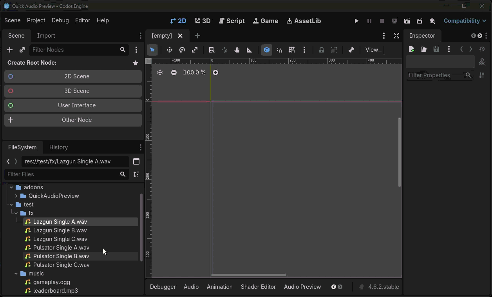

# Quick Audio Preview for Godot

Written by Yuri Natividade

## What does it do?

Click on a audio asset at the File System tree to play the audio.
Click again, while playing, to pause the audio.
Show a Audio Preview Panel to control the playback.



Youtube Link:

[](https://www.youtube.com/watch?v=2TGvnwDJRME)

## Installation

1. Create an `addons` directory in your Godot project
2. Copy the `addons`>`QuickAudioPreview` folder to your `addons` directory
3. Enable the plugin in `Project Settings | Plugins`

You might need to close and open your editor or open a new script file to start seeing anything working. I don't know why. Pull requests welcome.

Your Godot directory structure should look like this:

```
res://addons/QuickAudioPreview
```
